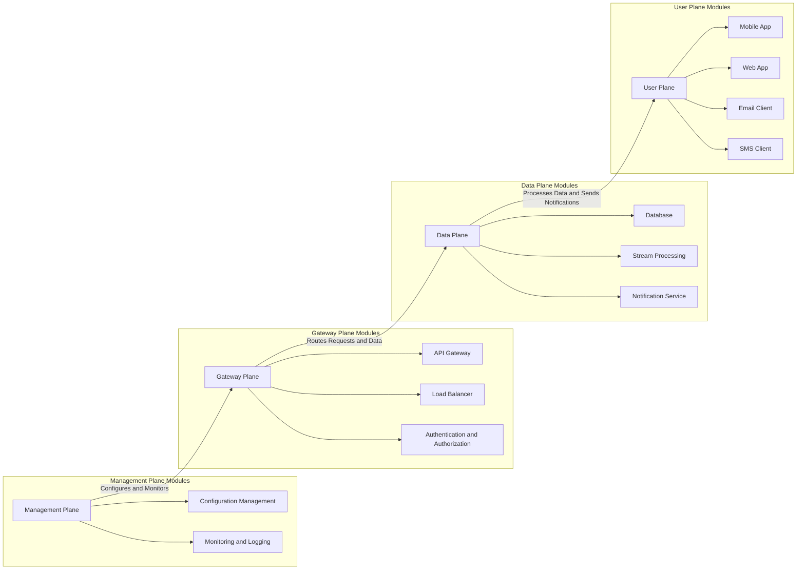
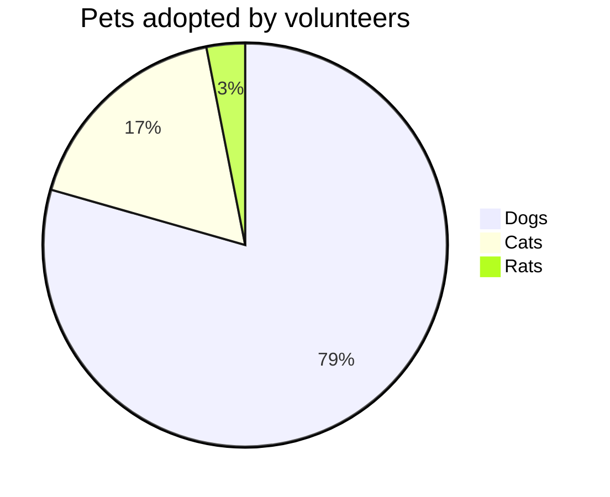
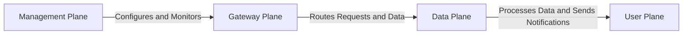

# Communication & Notification Management Platform (CNMP)

```mermaid
graph LR;
    A[Management Plane] -->|Configures and Monitors| B[Gateway Plane];
    B -->|Routes Requests and Data| C[Data Plane];
    C -->|Processes Data and Sends Notifications| D[User Plane];

    subgraph Management Plane Modules
        MA[Configuration Management]
        MB[Monitoring and Logging]
        A --> MA
        A --> MB
    end

    subgraph Gateway Plane Modules
        GA[API Gateway]
        GB[Load Balancer]
        GC[Authentication and Authorization]
        B --> GA
        B --> GB
        B --> GC
    end

    subgraph Data Plane Modules
        DA[Database]
        DB[Stream Processing]
        DC[Notification Service]
        C --> DA
        C --> DB
        C --> DC
    end

    subgraph User Plane Modules
        UA[Mobile App]
        UB[Web App]
        UC[Email Client]
        UD[SMS Client]
        D --> UA
        D --> UB
        D --> UC
        D --> UD
    end


```

```mermaid


pie title Pets adopted by volunteers
"Dogs" : 386
"Cats" : 85
"Rats" : 15

```

```mermaid


graph LR;
    A[Management Plane] -->|Configures and Monitors| B[Gateway Plane];
    B -->|Routes Requests and Data| C[Data Plane];
    C -->|Processes Data and Sends Notifications| D[User Plane];


```
